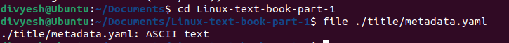

# Lab - Chapter 05

## Objectives

The objectives of this lab are to use the shell commands we learned in this chapter and understand their proper usage and form. The outcome will help your ability to successfully use the Linux Shell for navigation, file creation, and file modification. Resist the temptation to use the GUI file manager and a web browser. All actions will be done through the shell unless noted.  

**Note:** All work should be done on either Ubuntu desktop or Fedora desktop unless noted and using the Terminal.

### Part 1

Here we will be creating a number of directories and files in order to navigate our filesystem. Each step can be satisfied with a short line of text or a screenshot.

1. Open a terminal, `cd` to the **Documents** directory. Issue the `pwd` command to find your present working directory (or current location).  

2. In the **Documents** directory, use the `mkdir` command to create a directory named: **class-notes**   

3. `cd` into the `class-notes` directory. Issue the command to show your present working directory.  

4. Create the a directory named `distros` in the `class-notes` directory. Once created take a screen shot of the output of the `ls` command in the `distros directory  

5. Under the `distros` directory create a directory named: `BSD`  

6. Under the `distros` directory create a directory named: `Debian`  

7. Under the `distros` directory create a directory named: `redhat`  

8. In the directory `BSD` use the command to create a file: Create three files names: oracle-linux.txt, openbsd.txt, and netbsd.txt  

9. In the directory `Debian` use the command to create a file: Create three three names: ubuntu.txt, freebsd.txt, and xubuntu.txt  

10. In the directory `redhat` use the command to create a file: Create three files names: fedora.txt, rhel.txt, and debian.txt  

11. `cd` to the `distro` directory and create a file named: `omnios.txt`  

12. In the text files created you will notice that a few of them are out of place, such as `debian.txt` is in the `redhat` folder. Issue the command to move the text files to the correct locations and show a directory listing before and after the move command.  (*Hint*: ls mv ls)  

13. Use the `mv` command to rename the `redhat` directory to have an uppercase "R"  

14. Use the `rm` command to delete the oracle-linux.txt file  

15. Use the `mkdir` command to create a directory in the `distros` directory named: **illumos** and move the omnios.txt file into the **illumos** directory  

16. What would be the command to `cd` from your current location to the relative path of `./distros/BSD` directory using a relative path?  

17. What would be the command to change directory from your current location to the `Redhat` directory using a relative path?  

18. What would be the command to change directory to your **HOME** directory using the relative path?  

19. What would be the command to change directory from your **HOME** directory to the `debian` directory using a relative path?  

20. What would be the command, using an **absolute** path to change from your current directory to the `/etc/ssh/` directory?  


### Part 2

1. Use the `man` command to figure out how to display the format of the `date` command as month, day, year combined to look like: 10152021  

2. Using the file on Ubuntu: `/var/log/syslog`:  Type the command to display the last 10 lines of this file  

3. Using the file on Ubuntu: `/var/log/syslog`:  Type the command to display the first 10 lines of this file  

4. Using the file on Ubuntu: `/var/log/syslog`:  Using the `man` command on the previous question, find how to display the last 25 lines of this file  

5. Using the file on Ubuntu: `/var/log/syslog`:  Type the command to display the entire contents of this file backwards (last line to first)  

   * **Command is = ```sudo tac /var/log/syslog```**
6. Using the file on Ubuntu: `/var/log/syslog`:  Use one of the commands to allow for paging through one of these commands (hit 'q' to quit the paging command)  

7. Change directory to the Documents folder under your **HOME** directory and issue the command to Git clone the textbook source code. Issue the command: `git clone https://github.com/jhajek/Linux-text-book-part-1.git`. (*Hint:* You may have to use your distro package manager to install the `git` tool)  

8. Issue the `cd` command to change directory into Linux-text-book-part-1 and then issue the command to display what type of file `./title/metadata.yaml` is.  

9. Issue that same command to display what type of file `Appendix-A` is.  

10. Using in the book source code, under files > chapter-05 > sample-script: copy the file `sample-command` to your home directory. Use the command to the give the script execute permission `+x`.  Issue the `ls -l sample-script/sample-command` command to show the permissions of just the `sample-command` file  

11. Move the file `sample-command` to the location `/usr/local/bin` (**Note:** you will need to add the `sudo` command in front to give yourself root privilleges to move a file to this location)  

12. From the command line (any location) execute the command: `sample-command`, and if succesful you will receive a message of success  

13. Execute the `ssh-keygen` command on the command line (from any location) and accept all the default values (just hit enter for now, we will cover RSA in depth later in the text). This command generates two files that are part of an RSA keypair, located in `~/.ssh`  

14. `cd` into the directory `~/.ssh` and type the command to show the long listing of the directory.  

15. From the textbook sample code > Files > Chapter-05 > sample-scripts > copy the file `date-time-script.sh` to your home directory.  `cd` to your home directory and execute the shell script you just copied (which will print out the current datetime) with the command: `./date-time-script.sh`.  You get an error message stating **permission is denied**: Explain why?  

* **Explanation: You get a permission denied error because the script doesn't have execute permission.**
16. Type the command to grant execute permission for `./date-time-script.sh`  

17. From the cloned textbook sample code under the directory `files` > `Chapter-05` > `sample-textfiles`, issue the command to display the content of the distro-list.txt to the screen  

18. Issue the command using a relative path to copy the file `distro-list.txt``to the` distros ` directory you made under the `class-notes` folder  

19. Issue the command to show the listing of the `distros` directory and show that the file was copied  

20. In the clone class textbook directory, `Linux-text-book-part-1`, issue the command to delete the `Mobi` directory and its contents, under `output`  

21. Issue the command make a cp of the entire directory `Linux-text-book-part-1` and all sub-directories named `textbook-copy` located in your **HOME** directory.  

22. Issue the command to delete the directory `Linux-text-book-part-1` and its sub-directories in one command (recursively).   
