# Lab Chapter-07

## Objectives

The objective of this lab is to master vi commands and shell scripts

## Outcomes

At the end you will have mastered the basics of vi and now be proficient in the tools of Linux shell scripting

### Prerequisites

* You will need an additional virtual machine with Ubuntu Server 22.04 installed for this entire lab
* You will need to make sure the `vim` program is installed
* You will need to clone/pull the Textbook source code to the Ubuntu Server virtual machine in the home directory
   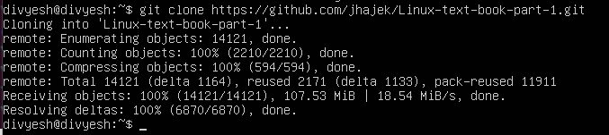
* You will need to install the program ```vimtutor```
  * On Ubuntu by typing ```sudo apt-get install vim vim-runtime vim-gtk```  
  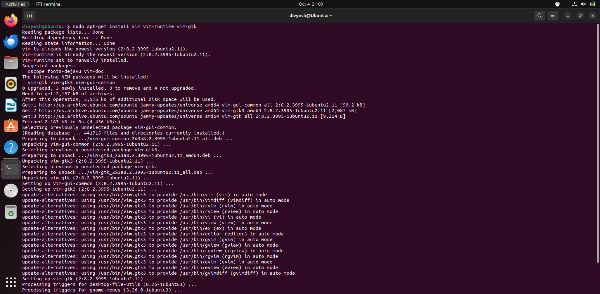
  * On Fedora by typing ```sudo dnf install vim vim-enhanced```   
  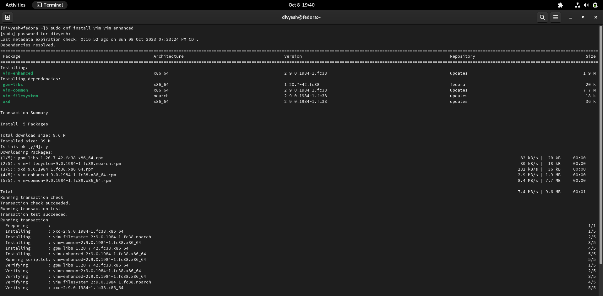
  * There is a good text explanation of each of the vim tutor exercises: [https://www.systutorials.com/vim-tutorial-beginners-vimtutor/](https://www.systutorials.com/vim-tutorial-beginners-vimtutor/ "vimtutor exercises")   

   

#### Part 1

1. Using Ubuntu or Fedora Desktop, type the command ```vimtutor``` from the terminal. __Warning:__ ```vimtutor``` requires you to read the instructions carefully!
    * This is a 6 part tutorial. You need to follow all the steps of the 6 part tutorial making your changes directly in the file.
    * __Be careful__ to save the file to an external location – otherwise IT WILL BE OVERWRITTEN each time you launch the vimtutor command. You can do this by typing ```:w  ~/Documents/vimtutor.txt``` - this way you can edit the file on your local system instead of launching the vimtutor application again. Note you need to use ```vim``` for this assignment.
     
       ```:%s/python/python3/g```
    
    * Save the finished output of `vimtutor.txt` in `vim` using the `:w` command

     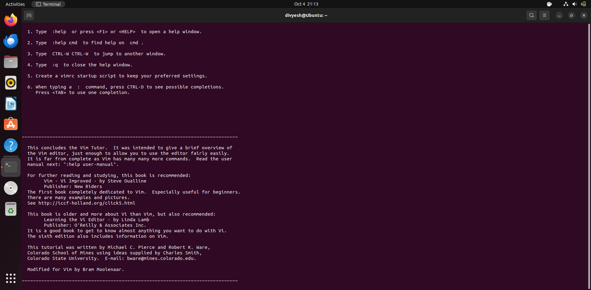
    
    * **file in : itmo-556/week-07/vim_tutor/vimtutor.txt**

#### Part 2

1. On Ubuntu Server from the textbook source code folder: ```files/Chapter-07/lab```, copy the file ```install-software.sh``` to your home directory   
     

     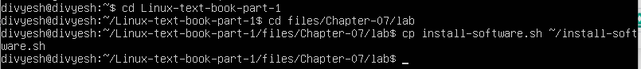

    * Using vim/ex commands, find all occurrences of ```python``` and replace them with ```python3```    
      * Commands ```vim ~/install-software.sh``` and ```:%s/python/python3/g``` then save and exit ```:wq```
    
       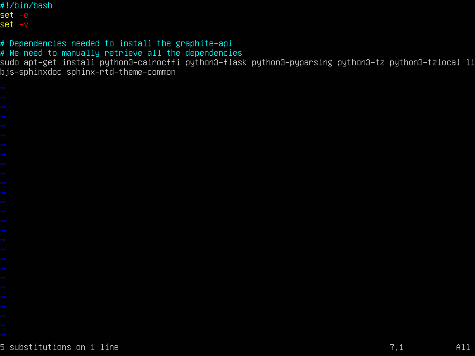

    * Save file and quit the vim editor
    * To test your work, give the shell script execute permission and execute it by using `sudo ./install-software.sh`
       
        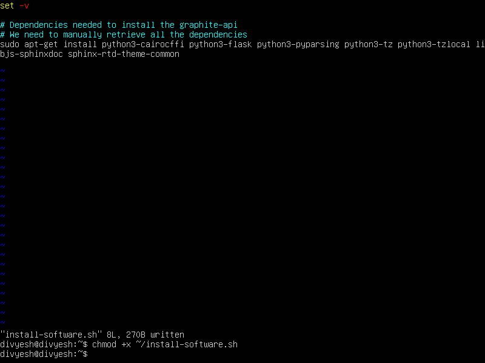

    * Take a screenshot of the result   

         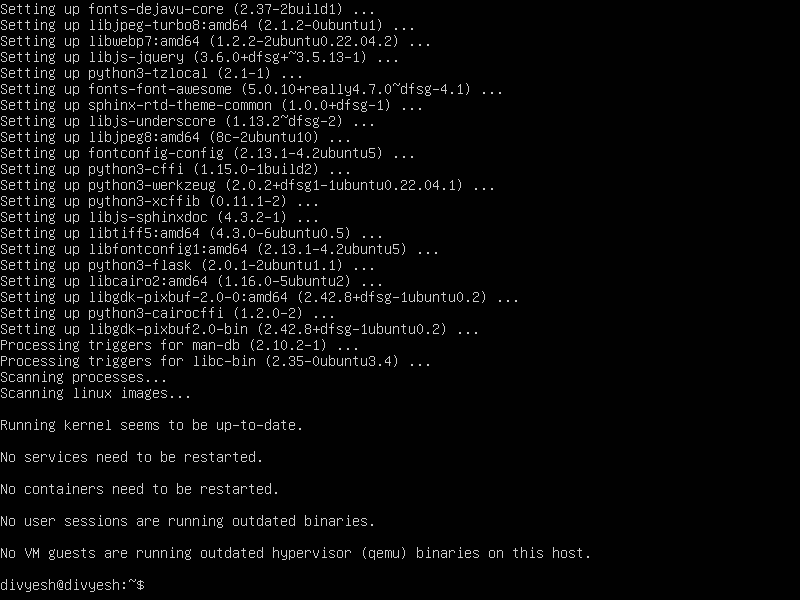


#### Part 3

1. Using Ubuntu Server, in your home directory, using vim, create a shell script named ```first-shell.sh``` in your home directory that contains the following:
    * Add the proper *shebang* on the first line.
    * Add two lines of space
    * Store the output of the command ```date``` into the shell variable named **DT**
    * Add the command that will print out the text: "#############"
    * Add the command that will print out the text: "Shell successfully execute at: $DT"
    * Add the command that will print out the text: "#############"
    * Save the file and quit the vim editor
    
         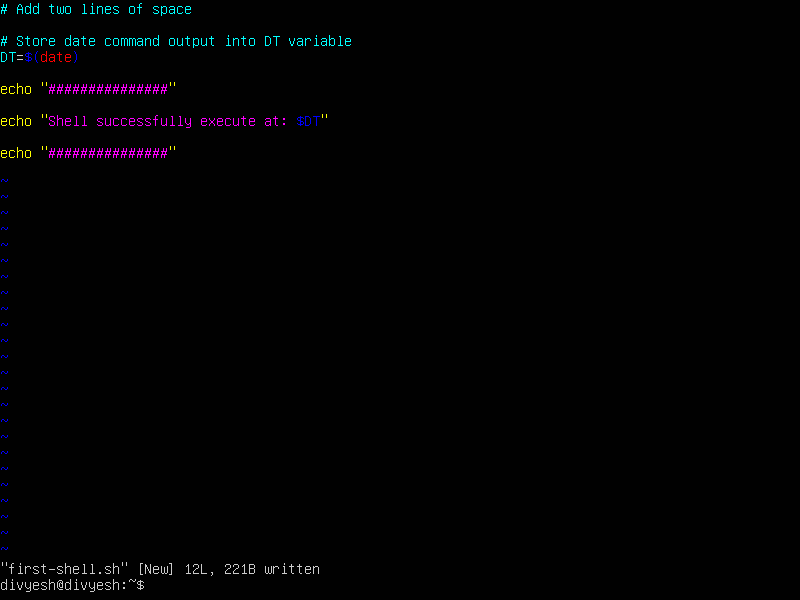

    * Execute the command to give first-shell.sh execute permission
    * Take a screenshot of the output executing first-shell.sh
        
         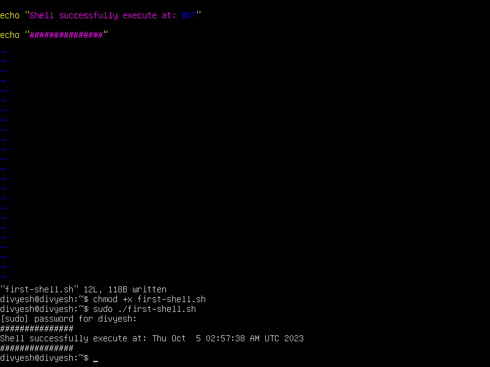

    * Take a screenshot of the command used to print the content of the file: first-shell.sh

         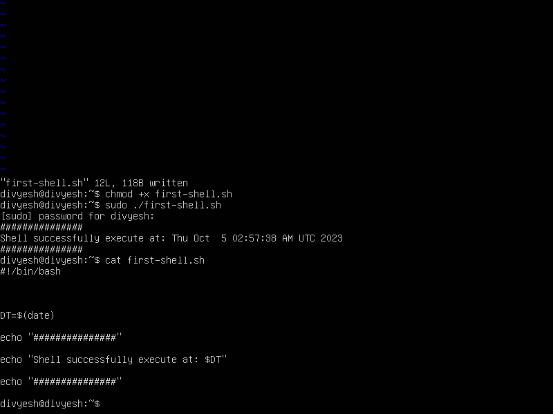

2. Using vim:
    * Create a shell script named **install-textbook-dependencies.sh** in your home directory.
    * Add the proper *shebang* on the first line, then two lines of space
    * Type the lines below into your shell script
    * Edit Line 3 of chapter-01.md to add your name next to mine   
        
        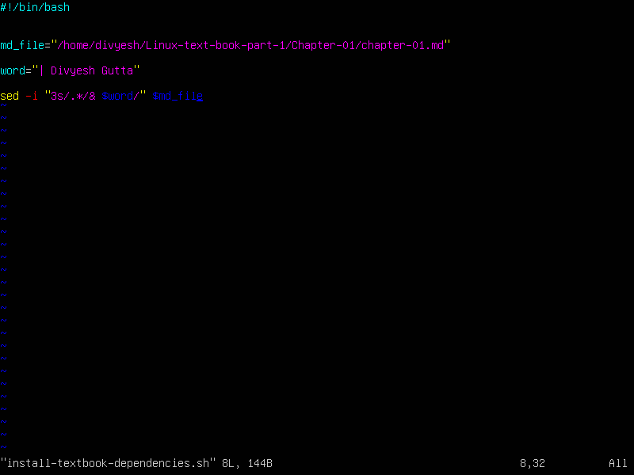

    * Give the script execute permission and execute it    

         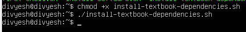

    * To test the results, `cd` into the Linux-Text-Book-Part-1 directory (clone it if you have not) and execute the the script: `./build-linux-and-macos.sh` (the script should already have execute permission)   

         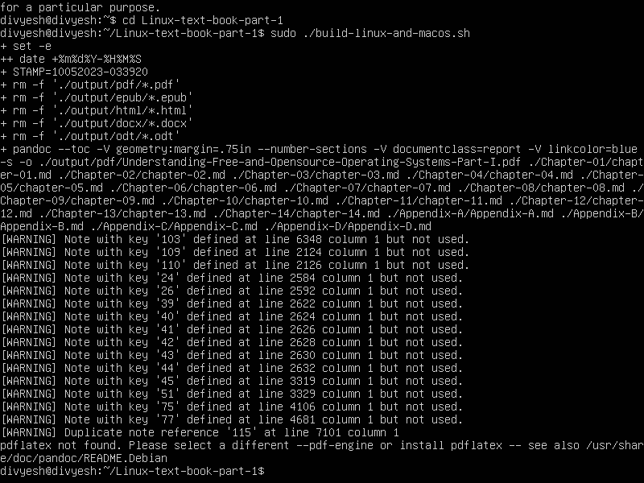   

    * To test if the textbook built correctly - cd into the directory: **output/pdf**.  Issue the `ls` command and you will see two PDF files. Open one to Chapter 01 to see your name.   
      
        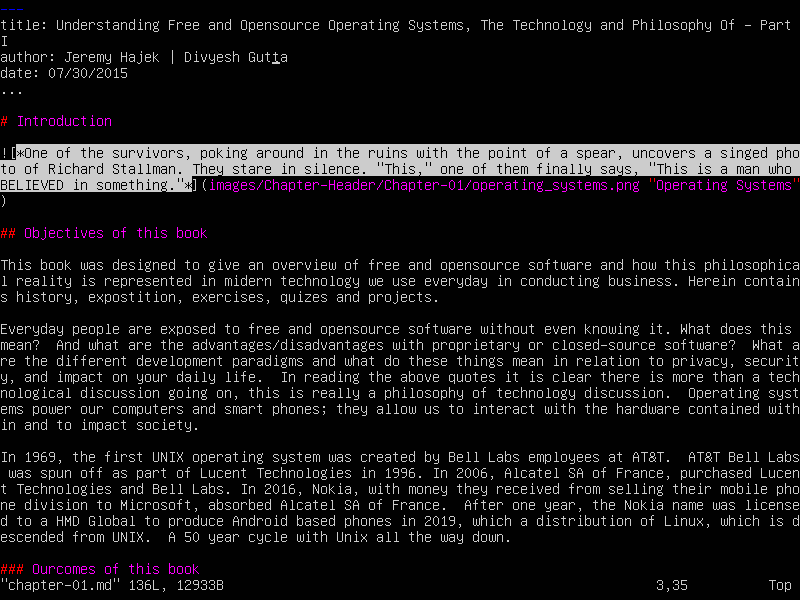

#### Part 4

1. In Ubunut Server, using the `sudo mv` command, move your shell-script: `first-shell.sh` to `/usr/local/bin`.  Execute the command `first-shell.sh` and take a screenshot of all the previous commands and output
    
    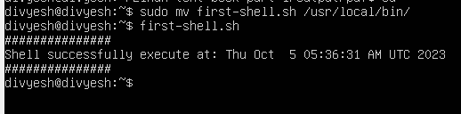

2. In Ubunut Server, inside the Textbook sample code > files > Chaper-07 > logs > u_ex151002.log write a `grep` command to find each line that has `*.php` in it   
   **command is ```grep '\.php' u_ex151002.log```**

    

  * Pipe the output of that command to another grep command to find all the lines that have `.php` and NOT `xmlrpc.php`   
  **command is ```grep '\.php' u_ex151002.log | grep -v 'xmlrpc.php'```**

    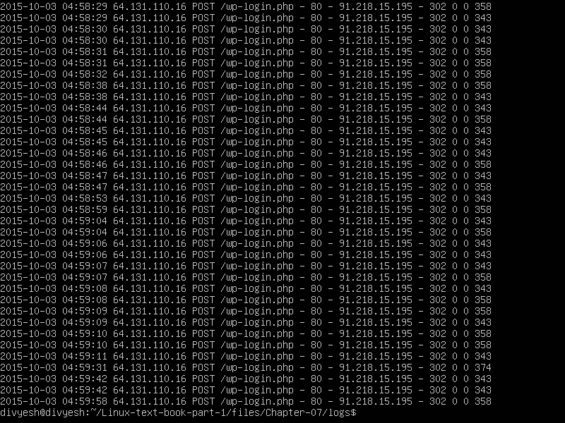
    
```bash

#!/bin/bash

sudo apt-get -y update
sudo apt-get install wget git
if [ -e ./pandoc-3.1.3-1-amd64.deb ]
  then
    sudo dpkg -i pandoc-3.1.3-1-amd64.deb
    rm ./pandoc-3.1.3-1-amd64.deb
  else
    wget https://github.com/jgm/pandoc/releases/download/3.1.3/pandoc-3.1.3-1-amd64.deb
    sudo dpkg -i pandoc-3.1.3-1-amd64.deb
    rm ./pandoc-3.1.3-1-amd64.deb
fi

sudo apt-get install -y texlive texlive-latex-recommended texlive-latex-extra texlive-fonts-recommended texlive-fonts-extra texlive-xetex texlive-font-utils librsvg2-bin texlive-science-doc texlive-science

wget http://packages.sil.org/sil.gpg
sudo apt-key add sil.gpg
sudo apt-add-repository -y "deb http://packages.sil.org/ubuntu/ $(lsb_release -sc) main"
sudo apt-get update
sudo apt-get -y install fonts-sil-charis

sudo apt-get -y install fonts-inconsolata
sudo fc-cache -fv
```
   