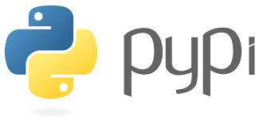

# Podcast Questions - Chapter 07

View or listen to this Podcast: [https://twit.tv/shows/floss-weekly/episodes/594?autostart=false](https://twit.tv/shows/floss-weekly/episodes/594?autostart=false "PIP Podcast page")



PIP AND THE PYTHON PACKAGE INDEX

* ~7:40 What is pip and how is it related to the Python language?
  * The Python package installer is called Pip. It is a command-line utility used to manage dependencies and install Python programs. By making the process of obtaining and managing third-party libraries and packages easier, it plays a significant part in the Python ecosystem.
* ~9:31 What are some of the utilities that a developer who is making a Python package are going to use?
  * Tools like setuptools, which aids in packaging Python projects, and twine, which is used to post packages to the Python Package Index (PyPI), are frequently used by developers when producing Python packages. They might also employ tools for testing frameworks (like pytest), documentation creation (like Sphinx), and version control (like Git).
* ~11:15 If someone is getting started with Python what is the right way to install packages?
  * The suggested way to install Python packages is by using pip, the package installer for Python. Developers can use pip to install packages from the Python Package Index (PyPI) using the command ```pip install package_name```
* ~12:39 Is the number of different package managers and methods of installing Python packages a benefit to the new user?
  * For new users, the variety of package managers and installation procedures for Python packages can be bewildering. It offers freedom, but it can also cause misunderstanding. But in the podcast they mentioned, pip and PyPI are straightforward, standardized approaches that are advantageous for new users.
* ~13:43 Does (did) Pradyun agree with the first speaker?
  * Pradyun agreed that the stability and usability of the Python ecosystem depend on having a centralized package index like PyPI and a common package installer like pip.
* ~14:34 Where does the overview of packaging for Python live (URL)?
  * On the official Python Packaging Authority website, at https://packaging.python.org/, we can find a summary of Python packaging.
* ~17:52 Where has Pradyun and pip secured opensource funding from?
  * Pradyun mentioned that pip secured open-source funding from the Mozilla Open Source Support (MOSS) program.
* ~19:00 What did Sumana do with the funding received from various companies and organizations?
  * Sumana mentioned that the funding received from various companies and organizations was used to improve the Python Packaging ecosystem. The funding was directed towards initiatives that enhance packaging tools like pip, making them more user-friendly and efficient.
* ~30:30 How does Sumana explain "DevOps"?
  * Sumana explained "DevOps" as a culture and set of practices that focus on collaboration and communication between development and operations teams. It aims to streamline the software development and deployment processes, ensuring faster and more reliable releases.
* ~31:37 What happens when you release software more often?
  * Software that is released more frequently receives user input more quickly, problems may be found and fixed more easily, and the development process is more agile. Additionally, it makes it easier to quickly roll out new features and upgrades to users.
* ~36:10 What is the Hollywood portrayal of those who develop and make software and how is it different from reality of developing software?
  * Hollywood frequently portrays programmers as speedy hackers who write code to get around security measures. Software development is actually a methodical, collaborative process that includes planning, testing, and adhering to best practices. As represented in movies, it is neither as glamorous nor as fast-paced.
* ~39:10 What can a short term Project Maintainer do for a software project?
  * A short term Project Maintainer can support a software project by aiding with duties like reviewing and integrating pull requests, resolving bugs, enhancing documentation, and supporting project management. Their contributions could keep the project moving forward and stable.
* ~43:20 How many maintainers did the pip project have in 2017? How many do they have now in 2020? Are they paid developers?
  * The pip project had about three maintainers in 2017. There were about seven maintainers in 2020. Although some maintainers could have gotten cash from grants or sponsorships, the majority are volunteers who give their time and effort to the project without getting paid directly.
* ~44:44 If pip is one of the most important tool chains in the industry -- who funds its development/maintenance?
  * The money for Pip's development and upkeep comes from a number of places, including open-source financing schemes like the Mozilla Open Source Support (MOSS) scheme. Additionally, the advancement of pip is greatly aided by contributions from the Python community and organizations.
* ~46:40 What is the programing language that Python is written in?
  * Python itself is primarily written in the C programming language. The CPython implementation is the most commonly used and is written in C.
* ~53:10 What is the tip for what not to do with pip on Linux?
  * Linux users should avoid using "sudo pip." Running "sudo pip" could result in issues with system packages and conflicts with the Linux package manager. To segregate Python environments and dependencies, it is advised to use virtual environments.
* ~55:15 What is the website (URL) to keep up with Python language announcements?
  * We can follow updates regarding the Python programming language by visiting the Python website's blog at https://blog.python.org.
  
Book mentioned in the Podcast:

* [The Bug by Ellen Ullman](https://www.amazon.com/dp/B00AZ181TQ/ref=dp-kindle-redirect?_encoding=UTF8&btkr=1 "The Bug by Ellen Ullman book purchase website")