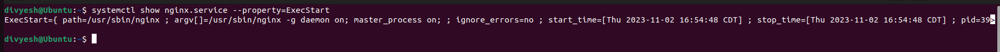

# Lab 10

## Lab 10 Outcomes

At the conclusion of this lab, you will be able to manage, edit, and list system processes in systemd--helping you to master the concepts of systemd. After each item take a screenshot and place it below the question to demonstrate the answer (unless specified otherwise). Edit your screenshots to show just the relevant information.

1) Change the default GRUB settings on your Ubuntu virtual machine uncommenting the entry `GRUB_DISABLE_RECOVERY="true"`. Save the changes the GRUB configuration file, reboot the virtual machine, repeating the process in the first question, and now take a screenshot of the same menu that is missing the recovery options. Hold the **shift** key down until you see the GRUB menu for some Linux distros.

    

    

2) Type the command to display your default `target` environment

    

3) Install the `openssh-server` package on your distro. Type the 3 commands be to enable the service to start at boot, start the service running, and check the service status?

    

4) Install the Nginx webserver package. What is the location on the filesystem of the `.service` file?

    

5) Breifly explain the recommended purpose of `/etc/systemd/system`  and `/lib/systemd/system`
* The `/etc/systemd/system` and `/lib/systemd/system` directories are both used to store systemd unit files. However, they have different purposes:
    * `/lib/systemd/system` : This directory is used to store unit files that are installed by packages. These unit files should not be modified directly, as they may be overwritten by package updates.

    * `/etc/systemd/system` : This directory is used to store unit files that are created by the administrator. These unit files can be used to override the settings of unit files in `/lib/systemd/system`.

    In general, it is recommended to use `/etc/systemd/system` for custom unit files, and to leave the unit files in `/lib/systemd/system` alone. This will help to ensure that your system remains stable and up-to-date.

    | Directory | Purpose |
    | --------- | ------- |
    | `/lib/systemd/system` | Store unit files that are installed by packages |
    | `/etc/systemd/system` | Store unit files that are created by the administrator |


6) Type the systemctl command to stop the Nginx service

    

7) Type the systemctl command needed to process changes to configuration files before restarting a service
* ```sudo systemctl daemon-reload```
  ```sudo systemctl reload-or-restart serviceName.service```   
In case of Nginx ```sudo systemctl restart nginx.service```

8) Type the systemctl command that will retrieve and display the `ExecStart` property from the Nginx.service file (not grep)
*   ```bash 
        systemctl show nginx.service --property=ExecStart
    ```

    

9) Type the systemctl command that will retrieve and display the `WantedBy` property from the Nginx.service file (not grep)

    

10) Using the `man` command explain what `timedatectl` does?
* In Linux, the system clock and its configuration can be accessed and modified using the `timedatectl` command. It belongs to the group of system administration tools called `systemd`.   

     ```bash 
     man timedatectl
     ```
     
* The manual page for `timedatectl` contains details on the many commands and settings that can be used with the utility. Viewing the current date and time, adjusting the system clock, defining time zones, and controlling NTP (Network Time Protocol) settings are examples of common functionalities.

    

11) Using the `man` command explain what `journalctl` does?
* In Linux, the journal is controlled by `systemd-journald}, and messages can be retrieved and viewed using the `journalctl` command. It gives access to the logs that `systemd` and its constituent parts have gathered.
   ```bash
   man journalctl
   ```
* The command's many arguments and features are detailed on the `journalctl` documentation page. You can examine and filter system logs using many parameters, including time, units, priority, and more.

     

12) Using the `man` command explain what `resolvectl` does?
* Through interaction with the `systemd-resolved} service, the Linux `resolvectl` command resolves IP addresses, domain names, and services. 
   ```bash
   man resolvectl
   ```
* The command's many arguments and features are detailed in the `resolvectl` manual page. It enables you to resolve domain names, query DNS resource records, and monitor DNS resolution service status.

* Resolving domain names, verifying the DNS setup, and using `systemd-resolved` to diagnose DNS-related problems on a system are a few typical applications for `resolvectl`.

     

13) Using the `man` command explain what `networkctl` does?
* In Linux, the `networkctl` command is utilized to examine and inquire about the condition of devices and network links overseen by `systemd-networkd` as well as further network functions.
   ```bash
   man networkctl
   ```
* The manual page for `networkctl` contains details on the command's features and parameters. You may see the properties and status of devices and network links with it. On your system, you can view the status, configuration, and other information of network interfaces.

* `networkctl` is frequently used to view IP addresses, examine network link properties, and verify the status of network interfaces. It is a helpful tool for finding out the current state of the network and addressing network-related problems.

     

14) Using the `man` command explain what `hostnamectl` does?
* In Linux, the hostname of the system and other relevant information can be viewed and modified using the 'hostnamectl' command. It offers a centralized method of managing the hostname of the system and is a component of the `systemd` suite.
   ```bash
   man hostnamectl
   ```

* The manual page for `hostnamectl` offers details on the command's features and parameters. It lets you see the system hostname that is currently in use, change the hostname, and see details regarding temporary and static hostnames. It also offers information on the machine ID, chassis type, and associated parameters.

* `hostnamectl` is frequently used to check the hostname that is currently in use, set a new hostname, and display identification information for the machine. It is a helpful tool for hostname-related configuration management and system identity management.

      

15) Install the package for `systemd-oomd`, using the `man` command explain what `oomctl` does?
* To install ```sudo apt install systemd-oomd```

* The `systemd-oomd` package includes the `oomctl` command, which is used to communicate with the `systemd` Out-of-Memory (OOM) Daemon. The goal of the OOM daemon is to enhance Linux systems' ability to handle out-of-memory scenarios.

   ```bash
   man oomctl
   ```

* The OOM daemon can be controlled and queried using the commands found on the `oomctl` documentation page. It contains information on several commands and options that let you work with the OOM daemon, like checking its status, turning it on or off, and changing its settings.

     

16) List the three headers or parts of a `.service` file?
* The three headers or parts of a .service file are:

    * **Unit:** This section contains information about the service, such as its name, description, type, and dependencies.
    
    * **Service:** This section contains information about how to start, stop, and reload the service.
    
    * **Install:** This section contains information about how to install and uninstall the service.

17) Using the command `timedatectl status`, copy the text output to your answer here. Use the `man` command to find how to change your system clock to `UTC`. Run the `timedatectl status` again and copy the output showing the difference--a screen shot is acceptable as well.

     

18) Use the `hostnamectl` command to:   
   a) set-hostname to itmo-556-xyz (xyz is your initials)    
   b) set-location to: d1r1u22    
   c) set-chassis to: vm     
   d) set-deployment to: development     
   e) display the changes by issuing the `hostnamectl` command

    

19) Use one of the tools described in the **Filesystems /proc** section and print out the exact processor/cpu type your Linux system is reporting.

     

20) In the textbook sample code: files > Chapter-10 > service-files there is a `.service` file named write-journal.service. Issue the commands to enable and start this service. This will require you to beforehand install the pre-requisite packages and create the `write-journal.py` script: the code is in the section **Logging and Service Files**. Write a `.timer` unit file (remember to enable and start the timer unit file), which will execute your `write-journal.service` once every 5 minutes.  Take a screenshot of the output of the `journactl` command that will show logs from only the `write-journal.service` showing that 10 minutes approimately elapsed. Take an additionl screenshot of the status of the systemctl timers to show the timer unit has been registered.

     
