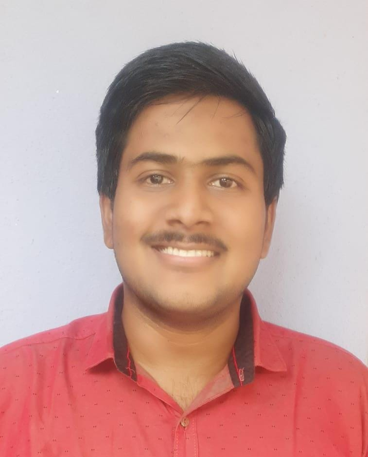

# Divyesh sai Gutta

## Where are you from

My name is Divyesh sai Gutta, and I am from India. I was born in Andhra Pradesh state. 

## IT Interest

From early childhood, I have been passionate about computer systems since I came across a software called turtle graphics in the school laboratory. It was interesting to learn how simple commands led to digital drawings. While growing up, I experienced many wonders and incorporated them into my life which made me even more passionate about Computers, Technology and Electronics.

Thus, to further pursue my passion, I opted to study the field of Electronics and Communication Engineering for my undergraduate studies, which I completed in the year 2022 with an aggregate of 75.2%. During this phase, I solidified my understanding of the fundamentals of Digital Signal Processing and Embedded Systems. I also have a decent grip on the concepts of C, C++, and Python.

## First Computing Device

My first computing device was a 

## Something Interesting About You

One interesting thing about me is that I have a multifaceted range of interests. On one hand, I'm an avid mobile gamer. I find mobile games to be a fascinating blend of entertainment and strategy. Whether I'm exploring immersive RPG worlds, solving intricate puzzles, or competing in fast-paced multiplayer games, mobile gaming is my way of unwinding and challenging my cognitive abilities.

On the other hand, I have a deep passion for geopolitics and staying up to date with global affairs. I believe understanding the complexities of the world we live in is crucial, so I dedicate a significant amount of time to reading, watching documentaries, and engaging in discussions about international relations and geopolitics. It's a constantly evolving field, and staying informed keeps me intellectually engaged.

These seemingly contrasting interests, gaming and geopolitics, offer a unique balance in my life. While gaming provides a break from the complexities of the world, my interest in geopolitics keeps me grounded and aware of the broader context in which we all live. It's this diverse blend of hobbies that keeps me constantly learning, adapting, and appreciating the richness of our world in all its facets.

