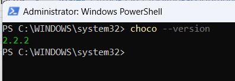
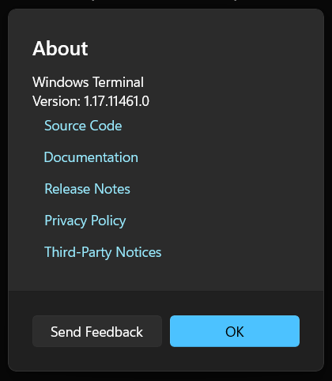
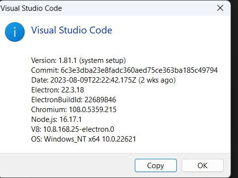
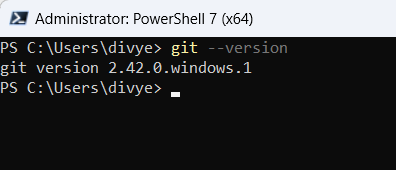
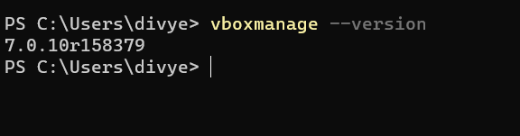
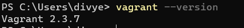
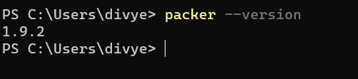
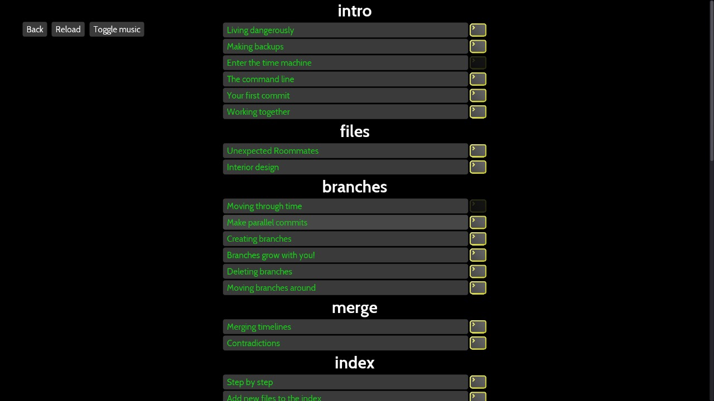
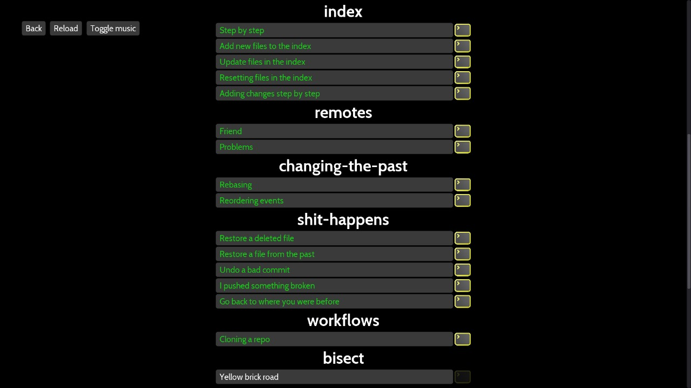
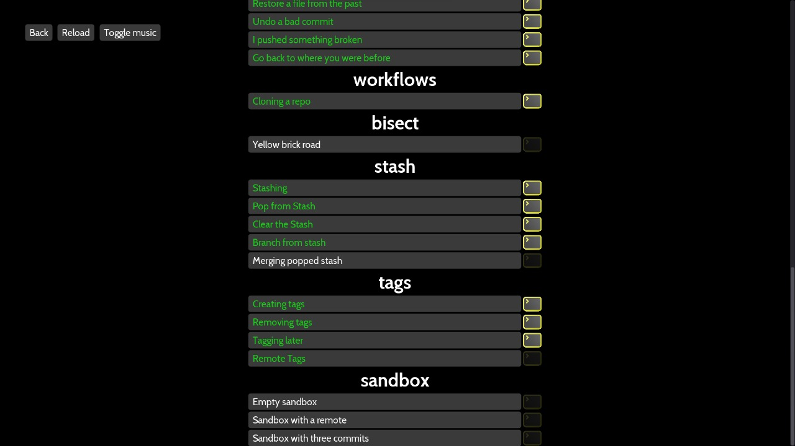

# Assignment
## Chocolatey
Chocolatey is a machine-level, command-line package manager and installer for software on Microsoft Windows. It uses the NuGet packaging infrastructure and Windows PowerShell to simplify the process of downloading and installing software.

## Powershell and SSH
* Powershell: Designed for cloud, on-premises, and hybrid environments, PowerShell 7 is packed with enhancements and new features. Installs and runs side-by-side with Windows PowerShell. Improved compatibility with existing Windows PowerShell modules. New language features, like ternary operators and ForEach-Object -Parallel.

* OpenSSH: You can start an SSH session in your command prompt by executing ssh user@machine and you will be prompted to enter your password. You can create a Windows Terminal profile that does this on startup by adding the commandline setting to a profile in your settings.json file inside the list of profile objects.

## Windows Terminal
Windows Terminal is a new, modern, feature-rich, productive terminal application for command-line users. It includes many of the features most frequently requested by the Windows command-line community including support for tabs, rich text, globalization, configurability, theming & styling, and more.

## VSCode
Visual Studio Code, also commonly referred to as VS Code, is a source-code editor made by Microsoft with the Electron Framework, for Windows, Linux and macOS. Features include support for debugging, syntax highlighting, intelligent code completion, snippets, code refactoring, and embedded Git.

## Git Client
Git is a distributed version control system that tracks changes in any set of computer files, usually used for coordinating work among programmers who are collaboratively developing source code during software development. Its goals include speed, data integrity, and support for distributed, non-linear workflows.

## Virtualbox
Oracle VM VirtualBox is a type-2 hypervisor for x86 virtualization developed by Oracle Corporation. VirtualBox was originally created by InnoTek Systemberatung GmbH, which was acquired by Sun Microsystems in 2008, which was in turn acquired by Oracle in 2010.

## Vagrant
Vagrant is a source-available software product for building and maintaining portable virtual software development environments; e.g., for VirtualBox, KVM, Hyper-V, Docker containers, VMware, Parallels, and AWS.

## Packer.io
Packer is an open source tool for creating identical machine images for multiple platforms from a single source configuration. Packer is lightweight, runs on every major operating system, and is highly performant, creating machine images for multiple platforms in parallel.

## Oh-My-Git Tutorial
Oh My Git! visualizes the internal structures of Git repositories in realtime. The player can immediately see the results of their actions: To accomodate people who are new to Git, the game features a custom-designed playing card interface!

