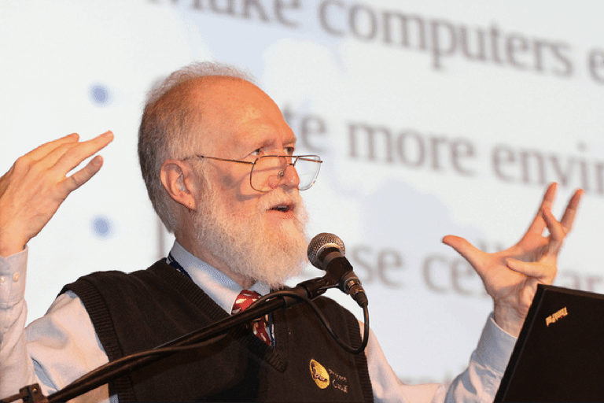

# Chapter 02 - Podcast Questions

* Who is John Maddog Hall and when did he start to program?
  * Jon "Maddog" Hall is a programmer, author, and advocate for free and open source software. He started programming in 1969 while studying electrical engineering. He learned by reading a book and practicing on an IBM 1130. 

* Briefly explain the difference between using gratis software and Free or Freedom Respecting Software.
  * The primary difference between using gratis software and Free or Freedom Respecting Software lies in the principles and rights associated with them:

    1. **Gratis Software:**
       - Gratis software refers to software that is provided at no cost, meaning you don't have to pay for it.
       - However, it may not necessarily grant you the freedom to use, modify, share, or distribute the software as you wish.
       - The software may come with restrictions, such as limited usage rights, proprietary licenses, or lack of access to the source code.

    2. **Free or Freedom Respecting Software:**
       - Free or Freedom Respecting Software goes beyond being cost-free; it adheres to the principles of software freedom.
       - Users have the freedom to use, modify, share, and distribute the software as they see fit.
       - This software typically comes with an open-source license (e.g., GNU General Public License) that ensures these freedoms and often includes access to the source code.
       - Users can study how the software works, make improvements, and contribute to the community.

     In essence, gratis software is about cost, while Free or Freedom Respecting Software is about the fundamental rights and freedoms associated with the software. The latter promotes transparency, collaboration, and user empowerment in contrast to the restrictions often imposed by proprietary or non-free software. 

## Why would companies pay to use RHEL?
  * Companies pay to use Red Hat Enterprise Linux (RHEL) and other open-source software for several key reasons:

    1. **Enterprise Support:** Open-source software like RHEL often forms the backbone of a company's IT infrastructure. By paying for RHEL, companies receive access to professional support, including troubleshooting, security patches, and updates. This support is crucial for maintaining stability and security in mission-critical environments.

    2. **Legal Compliance:** Some open-source licenses, like the GNU General Public License (GPL), have strict requirements for how the software can be used and distributed. Paying for RHEL ensures that a company remains compliant with these licenses, avoiding legal issues.

    3. **Long-Term Reliability:** RHEL offers long-term support (LTS) versions that are supported for an extended period, typically around ten years. This stability is essential for businesses that require a consistent and predictable operating environment.

    4. **Security:** RHEL places a strong emphasis on security. Paying for the software ensures that companies receive timely security updates and patches, reducing the risk of vulnerabilities and data breaches.

    5. **Vendor Accountability:** When a company pays for open-source software from a reputable vendor like Red Hat, they have a single point of accountability. This means they can rely on the vendor for assistance, rather than piecing together support from various sources in the open-source community.

    6. **Enterprise Features:** RHEL often includes enterprise-specific features, certifications, and integrations that are tailored to the needs of large organizations. These features can enhance performance, scalability, and manageability.

    In summary, companies pay for open-source software like RHEL to gain access to professional support, ensure legal compliance, maintain long-term reliability, enhance security, and leverage enterprise-specific features. This investment helps them build and maintain a robust and dependable IT infrastructure.

* Who is Maddog calling "Free Loaders" and why is he calling them this?
  * "Maddog" is a nickname for Jon "maddog" Hall, a well-known figure in the open-source software community. He is not calling anyone "Free Loaders" in a derogatory sense but rather advocating for a specific philosophy related to free and open-source software (FOSS).

    In the context of FOSS, the term "Free Loaders" is often used to refer to individuals or organizations that benefit from open-source software without actively contributing back to the community or financially supporting the development of the software. Maddog, along with many other FOSS advocates, encourages users and organizations to consider giving back to the FOSS community in some way.

    The idea is that FOSS thrives on collaboration and community support. When users and organizations take advantage of FOSS without contributing in any manner, it can be seen as taking without giving back. Maddog and others promote the idea of "paying it forward" in the FOSS ecosystem by contributing code, documentation, funding, or other resources to ensure the sustainability and growth of open-source projects.

    So, when Maddog refers to "Free Loaders," he is essentially encouraging a more active and supportive role within the FOSS community to maintain the spirit of collaboration and shared benefits that open-source software represents.

* Breifly explain why or why you do not agree with his conclusion stated in "Tying it all together"
  * In this Article, "Maddog" (Jon "maddog" Hall) discusses the changing dynamics and business decisions related to Red Hat Enterprise Linux (RHEL) and its relationship with the open-source community. He addresses the concern raised by some individuals and distributions about the recent changes made by Red Hat and IBM regarding licensing and access to RHEL.

    Maddog's main points and conclusions can be summarized as follows:

    1. **RHEL's Business Model:** Maddog recognizes that Red Hat and IBM have made changes to their business model, requiring customers to buy a license for every system running RHEL. This decision is aimed at generating revenue for the support and services they provide to RHEL users.

    2. **Concerns About "Freeloaders":** Maddog points out that while there is nothing wrong with individuals or organizations using open-source software for free, there are some who do not contribute to the community in any way and still benefit from the work of others. He refers to these individuals or organizations as "freeloaders."

    3. **Supporting the Community:** Maddog encourages people and organizations to contribute to the open-source community in various ways, such as promoting free software, starting Linux clubs, and helping others transition to Linux. He emphasizes that supporting the community is not limited to writing code but also includes advocacy and education.

    4. **Competition and Choices:** Maddog notes that several distributions have emerged as alternatives to RHEL in response to these changes. He suggests that these distributions could compete with RHEL in the enterprise market by creating their own enterprise-level offerings. However, he also cautions that it is not an easy or inexpensive endeavor.

    5. **Business Conditions:** Maddog acknowledges that businesses have the right to set their own business conditions, as long as they comply with the licenses they are under. He respects the decision of Red Hat and IBM to change their business model.

    6. **Alternative Distributions:** Maddog highlights the availability of numerous alternative Linux distributions for users, researchers, students, and hobbyists, emphasizing that they have a wide range of choices beyond RHEL.

    Overall, Maddog's perspective suggests that while changes in the RHEL business model may impact some users and distributions, there are plenty of alternatives available in the open-source ecosystem, and businesses have the right to adapt their strategies to their specific goals and market conditions.
