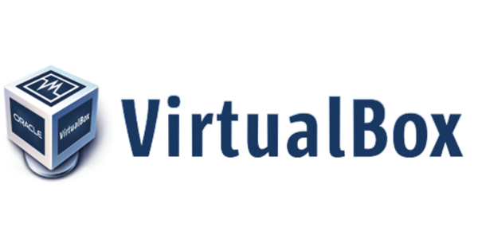

# Chapter-03 - Podcast Questions
   
Listen/watch the FLOSS podcast number 130 with the [VirtualBox Developers - http://twit.tv/floss/130](http://twit.tv/floss/130)

* ~2:35 Who is Andy Hall and Achim Hasenmuller?
  * Andy Hall is the Product manager for Oracle VM VirtualBox and Achim Hasenmuller is One of the lead architect
* ~3:00 What is Simon Phipps relationship to the VirtualBox project?
  * Simon Phipps is a member of the management team that played a role in the company's acquisition.
* ~4:45 What does VirtualBox do in Andy Hall's words?
  * According to Andy Hall, VirtualBox can be described as a hypervisor, which allows you to operate multiple machines concurrently on a single hardware platform.
* ~6:00 About what year did the product that became VirtualBox start?
  * The project was started in 2003, and the first version of VirtualBox was released in early 2007.
* ~11:20 According to Simon, what is the definition of open core?
  * The open-core approach involves providing a basic, open-source edition that lacks essential features, alongside a proprietary version that includes all the additional functionality.
* ~14:17 How does VirtualBox fit into Oracle's business model?
  * Oracle gained ownership of VirtualBox through its acquisition of Sun Microsystems in 2010, with Sun Microsystems being the initial creator of VirtualBox; subsequently, Oracle maintained the same development team from Sun Microsystems to continue VirtualBox's development.
* ~16:15 As of the time of the podcast (2010) how many downloads did VirtualBox have?
  * Around 30 million downloads

* ~20:25 How does VirtualBox handle virtualized I/O?
  * Raw mode execution, known as C2 patching, involves minimal code alterations with the hypervisor identifying and rewriting specific areas as needed while preserving the memory layout. When dealing with registers, it executes context switching, seamlessly transitioning between the main and guest operating systems. This process, orchestrated by the hypervisor, occurs transparently to the user, allowing for efficient system management.
* ~22:40 What did Intel and AMD introduce to help ease virtualization in VirtualBox?
  * Intel and AMD simplified virtualization by incorporating CPU enhancements. Intel referred to it as BTX, while AMD introduced it as AMDB virtualization.
* ~26:00 What two models of network card did VirtualBox choose to represent their virtual hardware and why?
  * The first approach involves emulating hardware components that operating systems are familiar with, allowing guest operating systems to utilize their own drivers for seamless compatibility. In contrast, the second option requires the creation of custom hardware, necessitating the development of individual device drivers for each supported operating system.
* ~27:40 What does VirtualBox almost get native performance on?
  * They integrated BERTIO network support, a technology from the KVM (Kernel-based Virtual Machine) domain, which consists of a dedicated virtual network card exclusively designed to assist a hypervisor, and it is an integral component of the Linux kernel.
* ~29:29 How does VirtualBox treat USB devices in Guest OSes?
  * VirtualBox enables the capturing of USB devices, ensuring that a USB device is exclusively accessed by a single device driver. When you connect it to a virtual machine, your host operating system relinquishes control, allowing the driver to load within the virtual machine.
* ~31:00 What are 4 virtual networking modes in VirtualBox?
  * 1. Exclusive Host
    2. Internal Network
    3. Bridging
    4. Network Address Translation (NAT)
* ~32:30 What is the difference between NAT and Bridged networking?
  * NAT mode is a suitable choice when aiming to maintain the privacy and security of your virtual machine (VM), or when facing IP address limitations on your network. On the other hand, Bridge mode is recommended if you intend to expose your VM to the public and require accessibility, or if your VM needs to run network-intensive applications or services.
* ~39:30 What Type of hypervisor is VirtualBox?
  * A virtual box is what people often call a Type 2 hypervisor, or hosted hypervisor.

* ~51:30 Why can't you virtualize Mac OSX on VirtualBox (as of 2014)?
  * Apple has incorporated specific checks within their macOS operating system to verify whether the underlying hardware bears the Apple brand. In such cases, VirtualBox allows these checks to pass through because it lacks the Apple system management chip, a specialized hardware component used by Apple for various purposes.