# Labs - Chapter 04

Using the virtual machines you installed in the previous chapter, Fedora Workstation and Ubuntu Desktop, you will now install additional software, themes, desktop environments, and window managers. You will combine screenshots of this newly installed software into a single document for submission.  We will be focusing on package based installs in the first part of the lab.

## GNOME Extensions

You will need to install the listed GNOME extensions from [https://extensions.gnome.org](https://extensions.gnome.org "Gnome extensions".).  The first one is the example in the book called *Caffeine*. Make sure you have the Gnome Shell integration installed to configure and install plugins directly from the browser.

1. Caffeine (screenshot of coffee cup icon in upper right corner).
* 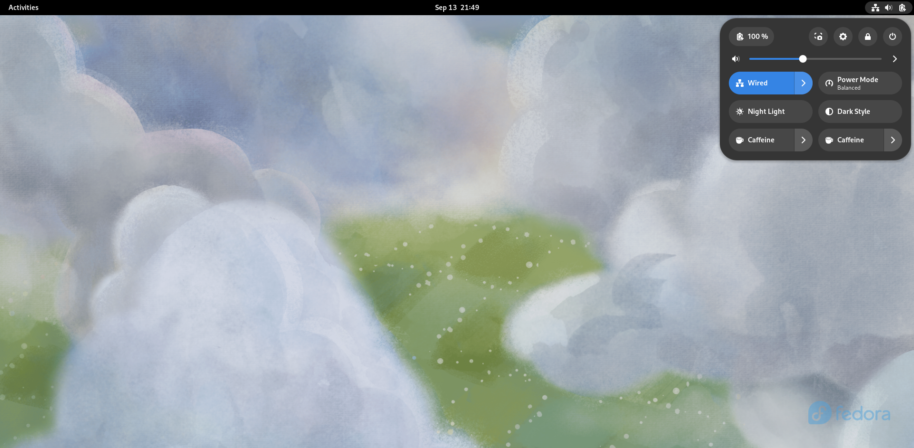
1. Bring out submenu of Power Off/Logout Button (Expands all poweroff and logout buttons).
* 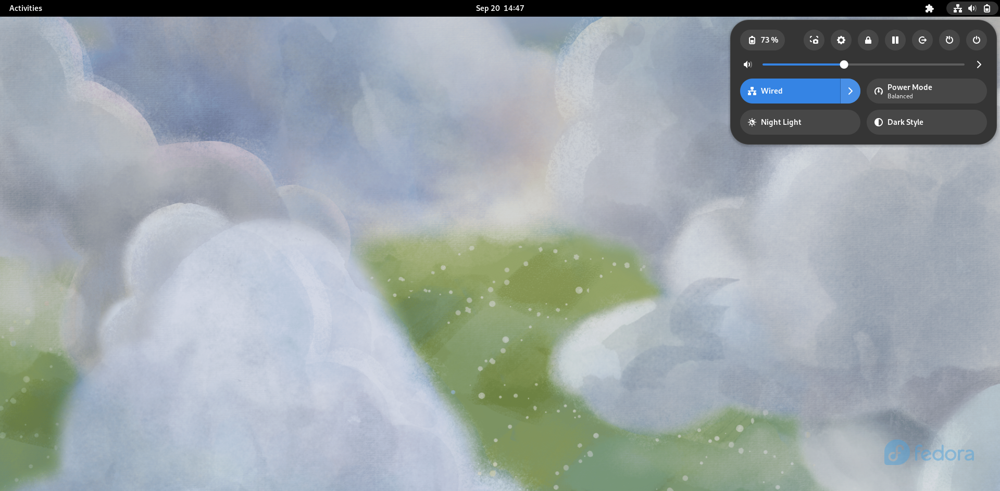
1. Exention List (List all extensions and their configs in upper right corner).

* 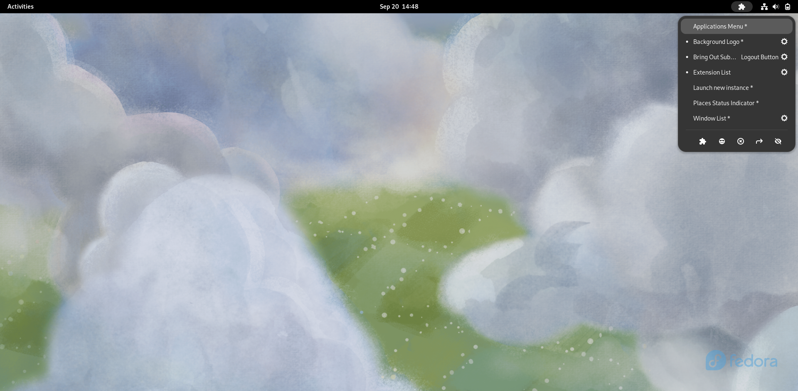

## Snaps Install

To install and configure snaps, reference chapter 3.  To show these packages are installed take a screenshot of the output of the command: `sudo snap list`. Install these packages via Snap on an **Ubuntu** based desktop.

1. From the Software store: KdenLive
2. From the Software store: code
3. From the Software store: Search for obs-studio
4. From Commandline search for and install: arduino
5. From Commandline search for and install: kicad  

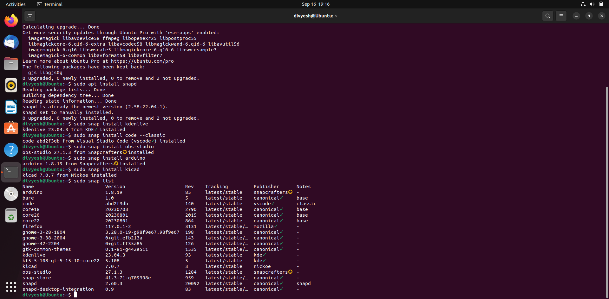

## Flatpak Install

To install and configure flatpak and flathub, reference chapter 3.  To show these packages are installed take a screenshot of the output of the command: `sudo flatpak list`. Install these packages via flatpak on s **Fedora** virtual machine:

1. From the Software store: Gnome Notes
2. From the Software store: Develop -> Visual Studio Code
3. From the Software store: Socialize -> Falkon Web Browser
4. From Commandline search for and install: VLC video player.
5. From Commandline search for and install: GtkStressTesting  

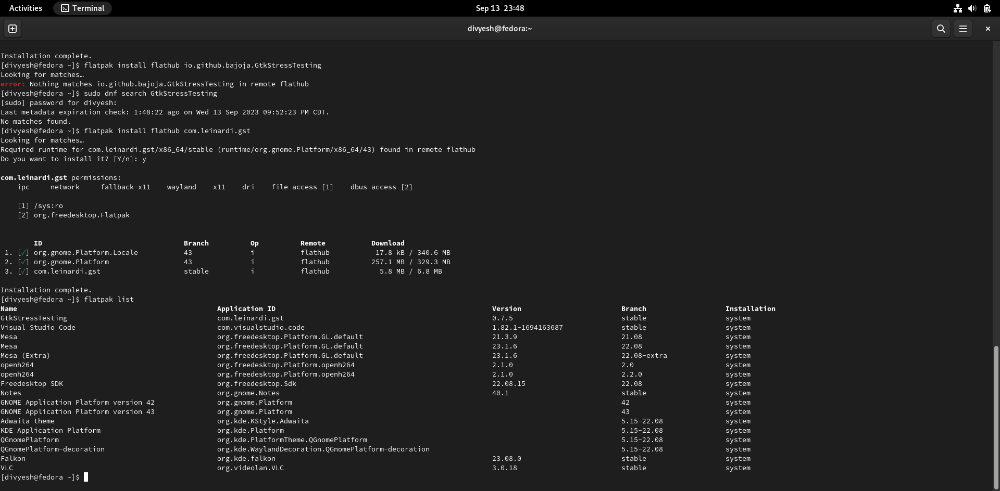

## AppImage Install

Using these three [AppImage install packages](https://appimage.org/ "AppImages install".), follow the instructions to install and run these AppImages on either Ubuntu or Fedora. Take a screenshot of the command needed to run the AppImage and the corresponding first screen of that application from the [AppImage GitHub repo](https://appimage.github.io/apps "AppImage GitHub Repo".).

1. Lagrange [Gemini client](https://en.wikipedia.org/wiki/Gemini_protocol/ "wiki article for Gemini Protocol".).
* 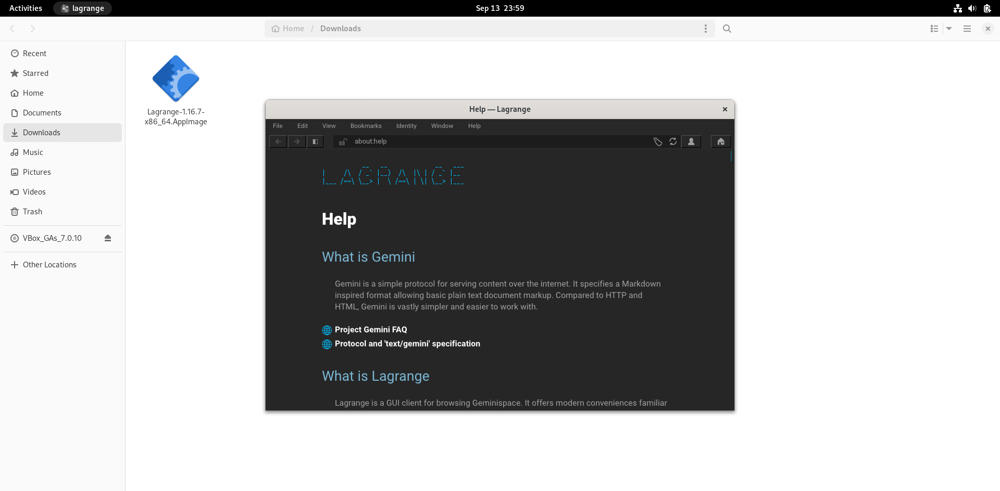
2. LibreWolf (Firefox fork).
* 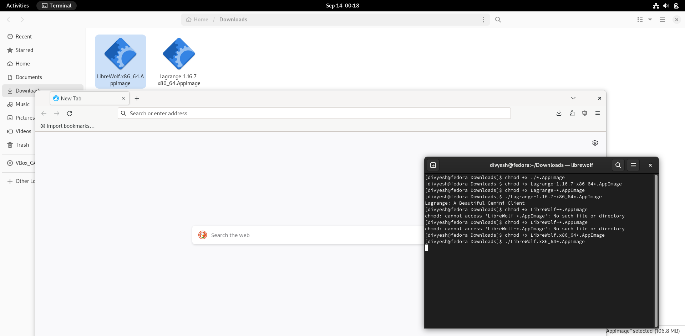
3. LibrePCB
* 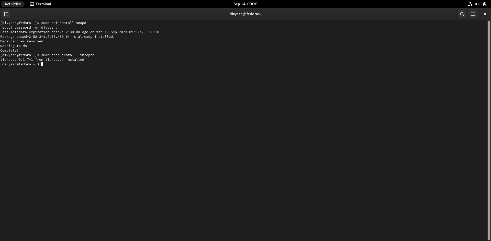

* 

## Installing Window Managers

You will install 3 of the window managers from the categories listed earlier in the chapter. Once installed you need to log out and restart your session. In order to change the default window manager or desktop environment--from the login screen, you need to click on the user name and select the little gear below the password field. In your screenshot open a terminal window, you might need to do some research to understand how to operate in a window manager.

* Stacking window manager - [IceWM](http://ice-wm.org/ "webpage for Ice WM").
  * Show 3 Windows stacked (FireFox, Terminal, and the File Manager).
  * 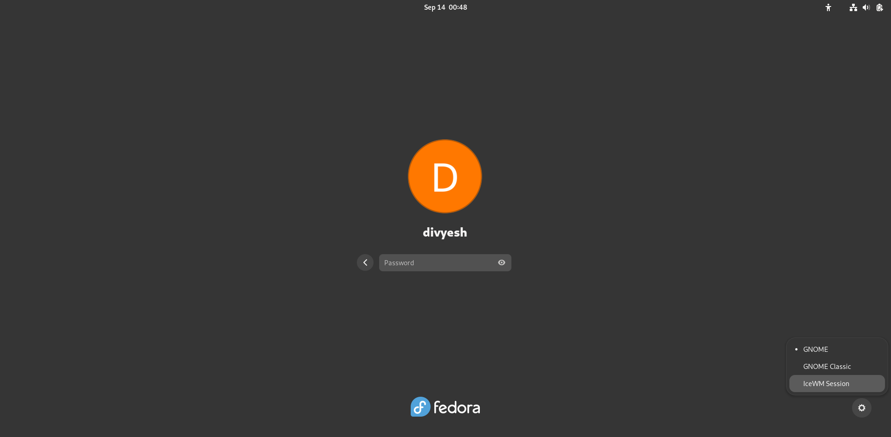  

  * 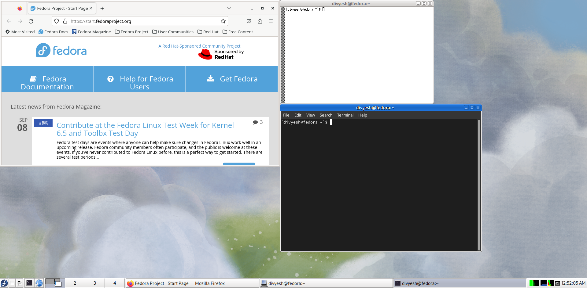
* Tiling window manager - i3
  * [i3 keyboard command reference](https://i3wm.org/docs/refcard.html "i3 keyboard command reference").
  * Show 3 Windows tiled, 2 Terminal Windows and 1 FireFox.
  * Use the link above to learn the key commands to launch windows, remember there is no mouse!
  * 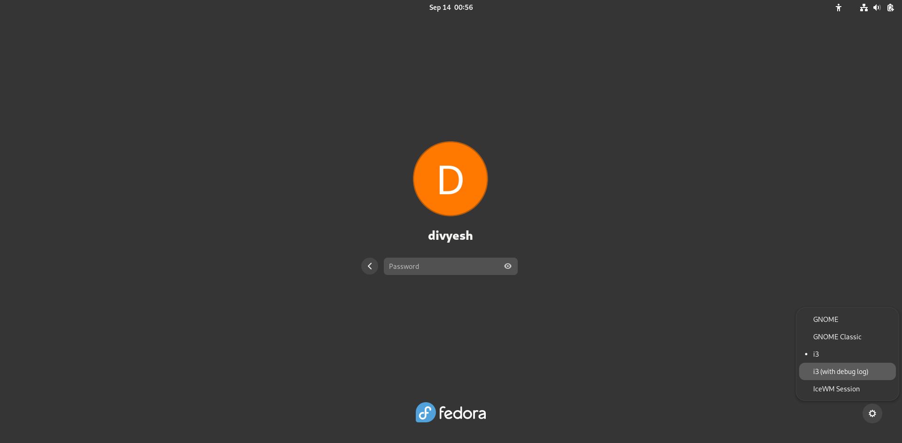  

  * 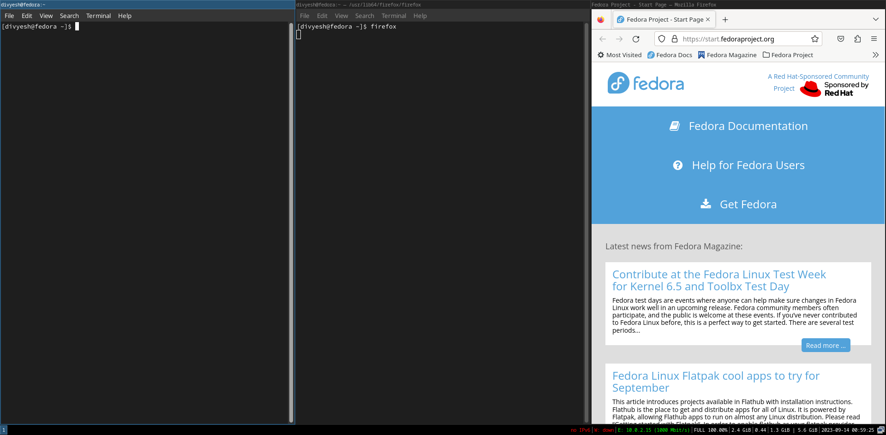 

* Tiling window manager - Sway
  * [Sway documentation](https://github.com/swaywm/sway/wiki/ "webpage Sway reference").
  * Show 3 Windows tiled, 2 Terminal Windows and 1 FireFox.

  * 
  * 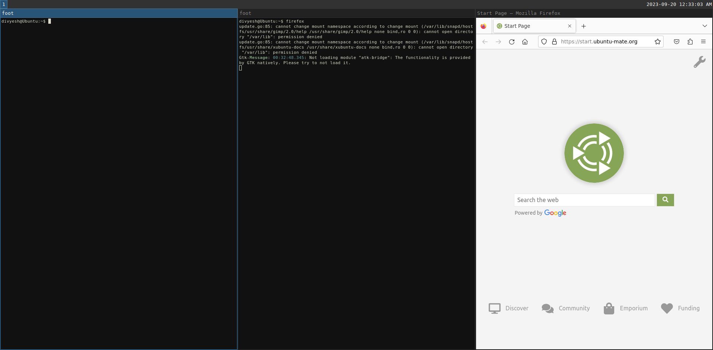

## Desktop Environment Installs

Install these desktops, restart your system and as you login switch your desktop environment and take a screenshot of the new environment.

1. Install the Budgie desktop on Fedora Workstation -> `budgie-desktop`

* 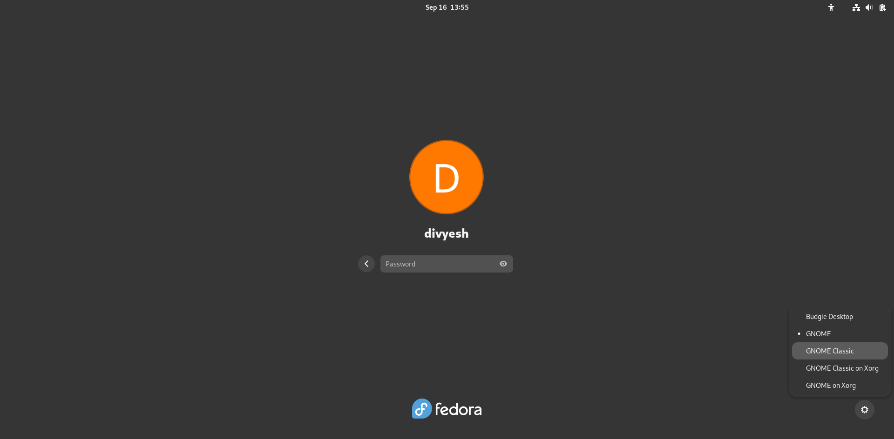

* 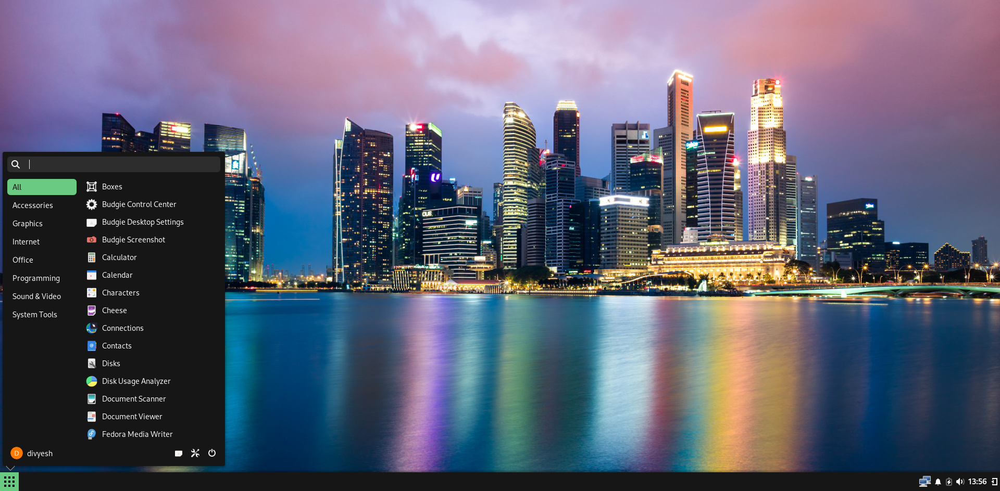

2. Install the Ubuntu Mate Desktop on Ubuntu Desktop -> `ubuntu-mate-desktop`

* 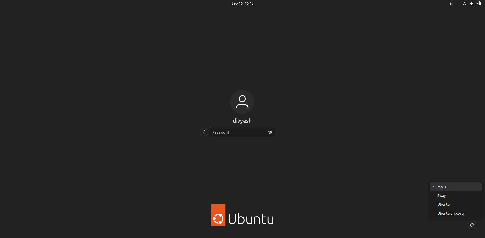

* 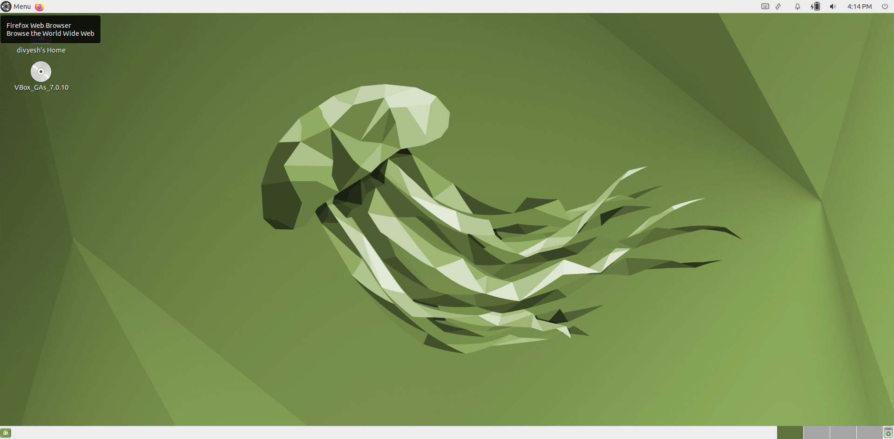