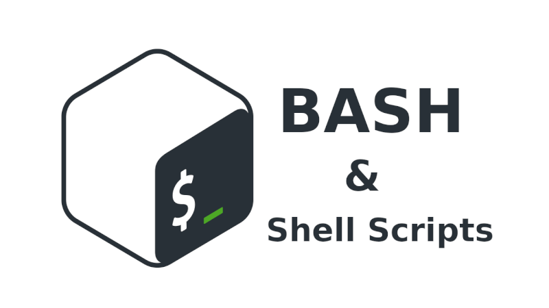

# Podcast Questions - Chapter 05

[Command Line Heroes: Bash](https://www.redhat.com/en/command-line-heroes/season-3/heroes-in-a-bash-shell "Command Line Heroes: bash")
   
* ~0:20 Who is the creator of the Bash Shell?
  * The creator of the Bash Shell is Brian Fox.
* ~0:43 Which organization did the creator of the Bash Shell write the shell for?  
  * The creator of the Bash Shell, Brian Fox, wrote the shell for the Free Software Foundation, which was founded by Richard Stallman.
* ~2:05 How does the podcast host define a shell script?
  * "Think of shell scripts like a script you would give an actor," the podcast's presenter says in defining a shell script. They provide the shell a comprehensive set of instructions that it may then repeat on its own, just like an actor can read her lines one after another. If your orders are complicated or repetitive, this is the best solution. It's essential for automation.
* ~2:23 Shell scripts are the key to what?
  * Shell scripts are described as the key to automation in the podcast.
* ~3:28 When did Ken Thompson release his shell and what was it missing?
  * In 1971, Ken Thompson made his UNIX shell available. However, this shell was not fully scriptable because it was originally intended to be a command line interpreter. Some of the sophisticated scripting features that will be crucial in later shells were absent.
* ~3:45 What year did shell scripting come into existence?
  * When Steve Bourne developed the Bourne shell, which included scripting capabilities, shell scripting began to gain popularity.
* ~4:27 What was the shell that became the AT&T UNIX standard shell?
  * The shell that became the AT&T UNIX standard shell was the Bourne shell, created by Steve Bourne.
* ~5:53 The Bourne Shell was licensed and owned by whom?
  * The Bourne Shell was licensed and owned by AT&T (American Telephone and Telegraph Company).
* ~7:59 Why was Brian Fox the perfect person to develop the Bash Shell?
  * Because Brian Fox had never seen the source code for Berkeley UNIX, UNIX, or Bell Systems, it was thought that he would be the best choice to design a clean-room implementation of the Bash Shell that wouldn't violate any copyrights. He wasn't familiar with the previous code, therefore he was able to build a new shell from scratch without using any of the preexisting codebases.
* ~9:30 How long did it take to create the Bash shell and what was difficult about this?
  * The Bash shell took about nine months to develop. The challenge in developing Bash was to accurately duplicate all of the behaviors of the Bourne shell, which was Stephen Bourne's initial shell, but simultaneously being permitted to extend and build upon it. The project was made more difficult and time-consuming by the requirement to provide a POSIX-compliant shell that was 100% compatible with every shell script ever developed for the Bourne shell.
* ~12:02 What did Brian accidentally do to the Bash Shell code?
  * By accident, Brian Fox removed the Bash Shell's source code. In order to delete a specific file, he typed "rm" followed by a space, the file name, and quotes. The Bash source code was among the source files that were ultimately deleted because there was no quotation implementation at that time.
* ~14:48 What was the other shell released one month before Bash?
  * Another shell called ASH, which was an open-source shell, was released about one month before Bash.
* ~15:19 When was GNU Bash released?
  * GNU Bash was released in 1989.
* ~18:40 What was the released/intended purpose of GNU Bash?
  * The GNU project launched GNU Bash with the intention that it would serve as a helpful replacement tool and contribute to the development of a free, open-source operating system. It was intended to be an open, unrestricted shell for UNIX-like systems that anybody could use.
* ~19:25 What words and terms are now in use in everyday English?
  * Thanks to Richard Stallman, Brian Fox, and other members of the free software and open source movements, the terms "free software" and "open source" are now often used in everyday speech. These words are now well known and used in everyday conversation around the world.
* ~20:46 Was Steven Bourne "cool" with the Bash Shell?
  * The Bourne shell's inventor, Steve Bourne, was okay with the Bash Shell. Steve Bourne was given a t-shirt with the words "Bourne again" on it by Brian Fox, the man who created Bash, when they first met at a convention. Despite Bash being a reimplementation of his shell, Steve Bourne was grateful for the gesture and did not take it personally.
* ~22:52 What prepares you to be more of a long-term thinker?
  * Learning scripting, such as Bash scripting, enables you to approach automation with a longer-term perspective. This perspective enables you to approach automation in a more strategic and long-term way by assisting you in understanding how scripts can be utilized to automate processes.
