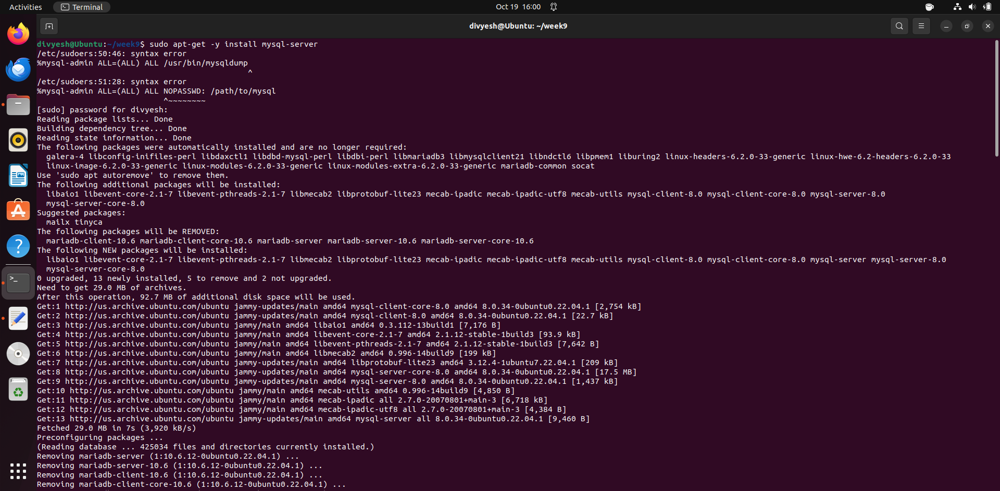
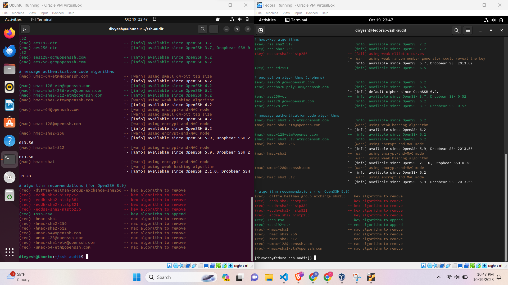

# Lab - Chapter 09

At the outcome of this lab you will be able to successfully understand how to apply the sudo/root user paradigm. You will understand the binary logging mechanism of journald. You will be able to add, delete, and modify user accounts. Finally, you will be able to succesfully setup and establish remote connections.

Assumptions:

* Assignments can be done using Ubuntu or Fedora desktop unless stated
* If a command asks you to work on a user that doesn't exist, it is assumed that you have to create it
* The ```mysqldump``` application requires the ```mysql-client``` package to be installed: [http://superuser.com/questions/165582/installation-mysqldump](http://superuser.com/questions/165582/installation-mysqldump)

1) Write a shell script that issues the command to add a user named "controller" to your system, using the system default values and display the content of the `/etc/passwd` file to show that the user has been created

2) Write a shell script that issues the command to add a group named *itmo356* to your system. Then use the command to modify the user and append this additional group to the user controller you just created.  Issue the command that shows all of the groups a user is a member of.

3) Write a shell script that issues the command to modify the user **controller** to add them to a *superuser* group (sudo on Ubuntu or wheel on Fedora based)

4) Write a shell script that issues the command to add the user named **nsa**, display the content of the `/etc/passwd` file, and then delete the user account, display the content of the `/etc/passwd` to show that the user has been deleted

5) Issue the commands to edit the ```/etc/sudoers``` file and give the **user** "mysql-backup" sudo privilege. Take a screenshot of the relevant line that you added to ```/etc/sudoers``` file. Command = ```sudo nano /etc/sudoers```

6) Issue the commands to edit the ```/etc/sudoers``` file and give the **group** "mysql-admins" sudo privilege. Take a screenshot of the relevant line that you added to ```/etc/sudoers``` file.

7) Issues the commands to edit the ```/etc/sudoers``` file and give the **user** "mysql-admin" sudo privilege to only use the mysql database backup command named `mysqldump`. Take a screenshot of the relevant line that you added to ```/etc/sudoers``` file.

8) Issue the commands to edit the ```/etc/sudoers``` file to give the user "mysql-admin" sudo privilege to only execute the ```mysql``` command and not require a password. Take a screenshot of the relevant line that you added to ```/etc/sudoers``` file.
    
9) Issue the command to list all log messages of priority levels ERROR and worse, from the current boot. 
   Command is ```journalctl -b -p err..emerg```
   

10) Issue the command to install the `mysql-server` (database) from the command line using either `dnf` or `apt-get`.
    Command is ```sudo apt-get install mysql-server```
    

11) Issue the command to list all the occurrences in the logs generated by `mysql-server` using journalctl.
    

12) Install the Nginx webserver in a virtual machine. In your Virtual Machine open a webbrowser and navigate to http://127.0.0.1. Then type in the address bar http://127.0.0.1/cats (this site will 404 -- not be found). Then issue the command to display the content of the Nginx access.log showing both connection you just made, from the log file
    

13) In your home directory, create a file named: todo-list.txt. Then create a group named: accounting. What command would you use to change the group ownership of the file todo-list.txt to be owned by the "accounting" group?  
    

14) Issue the command you would type to generate a RSA key pair, if you created it previously you can overwrite the previous key.
    

15) The next questions require some setup:
   i. You need two virtual machines for this part: One Ubuntu based and one Fedora based
   i. You will need to modify the Network settings to add a **Host-Only Network Interface** in VirtualBox to get a an IP address only accessible on your computer
   i. Install **openssh-server** on Ubuntu (Server) via apt and Fedora via dnf
   i. On Fedora only, you will need to issue two additional commands to start the ssh server: `sudo systemctl enable sshd` and `sudo systemctl start sshd`

   

16) Git Clone the repository [https://github.com/arthepsy/ssh-audit](https://github.com/arthepsy/ssh-audit "SSH audit tool") to both the client and server system, in your home directory. Run the ssh-audit tool on the Fedora and Ubuntu, list the weak ciphers installed by default, use 127.0.0.1 as the host IP
Commands for Fedora is ```./ssh-audit.py 127.0.0.1``` and Ubuntu is ```python3 ssh-audit.py 127.0.0.1```
    

17) Modify the client and servers using the example in the text to increase cipher strength, run the ssh-audit tool again and report any weak ciphers or security anomalies -- you will need to stop the service and start it again to make the changes active

    

18) Issue the command to connect remotely to the Fedora server via ssh using username and password, create a text file named: website.app - then exit the remote session. On the Fedora system show that the file: website.app, has been created

    

19) Issue the command to transfer an SSH ed25519 key pair to from your system designated as a client, Fedora, to the Ubuntu SSH server

    

20) Issue the command to connect remotely to the Fedora server via ssh using username and the identifyFile (RSA key), create a text file named: new-website.app - then exit the remote session. On the Fedora system show that the file: website.app, has been created

    
